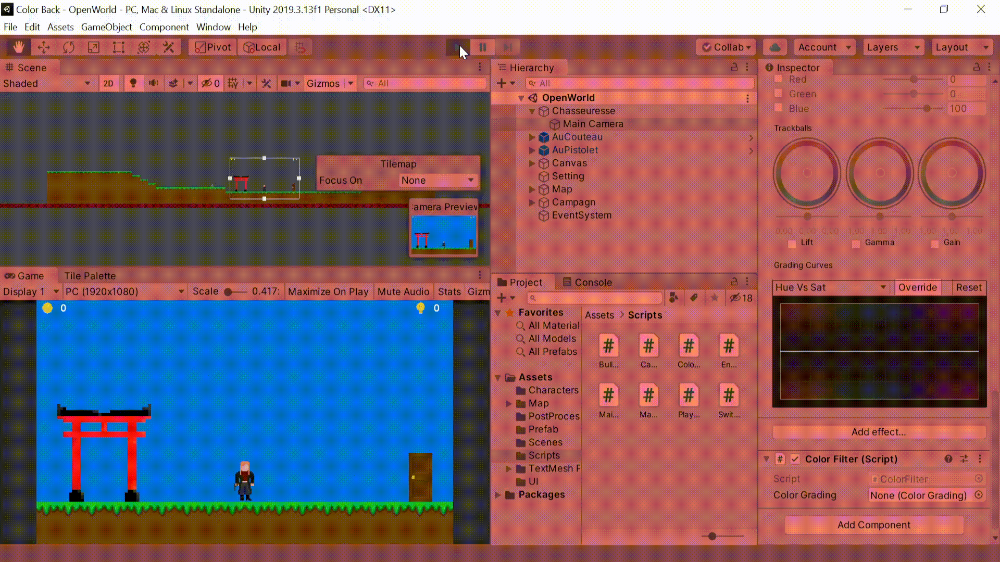

# Color Back
## Context:
It's a training project to learn how to manipulate the 2D mechanics in Unity including the tilemap tool and how to use post processing through scripts. It was also the opportunity to start writing a game design document. You can find in this repository, [game design document](Color%20Back%20-%20Game%20Design%20Document.pdf), scripts used and the all different assets drew (characters and maps components).

## Gameplay:
All the colors of the world have disappeared giving way to sadness, desolation and a world in black and white. The cause is, but no one knows, an evil creature that has absorbed the different colors that make up white light (violet, blue, green, yellow, orange and red). Your mission, huntress, will be to investigate the cause of this curse and eliminate the creature in order to bring back all the colors and save the world. 6 quests will allow to recover the 6 lost colors of the world and the elimination of the final boss will guarantee a lasting peace.

Use the `arrow keys` or the `W` and `D` keys to move from right to left. Use the `Q` key to change the plane. To fire your weapon, use the `right mouse button`.

## Preview:
Here is an overview of the color filtering system using a post processing filter and the script "ColorFilter". The colors appear by pressing separate keys on the keyboard because quests have not been implemented.

  

Here is an overview of the gameplay. It's a 2D game but it's possible to change the plane by going through the door. This justifies the change of environment and the spawn of a new kind of enemy.

  

## State:
- [ ] Work in progress
- [X] Work completed