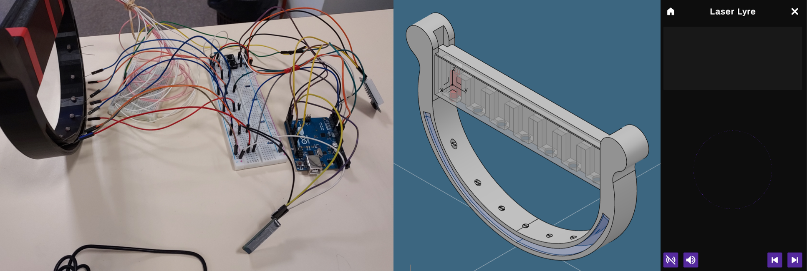

## Laser Lyre

> October 2023

**Challenge: Create a connected, digital musical instrument.**

Discover the Laser Lyre, a project merging music and technology. Your smartphone transforms into a speaker, while the app lets you visualize the music spectrum, and control the sound of notes.

The design of the Laser Lyre was created using CAD software and then, 3D printed. The lyre is connected to a smartphone via an Arduino Bluetooth module. The traditional strings of the lyre have been replaced by lasers. This not only adds a modern touch to the instrument but also enhances the musical experience by providing a unique way to play the instrument.

`New update:`

- Change the sounds of the notes using the application, as well as the lyre ;
- Play example songs using the application.

  

> #Unity, #IoT (Arduino), #CAD

## State:
- [ ] Work in progress
- [X] Work completed