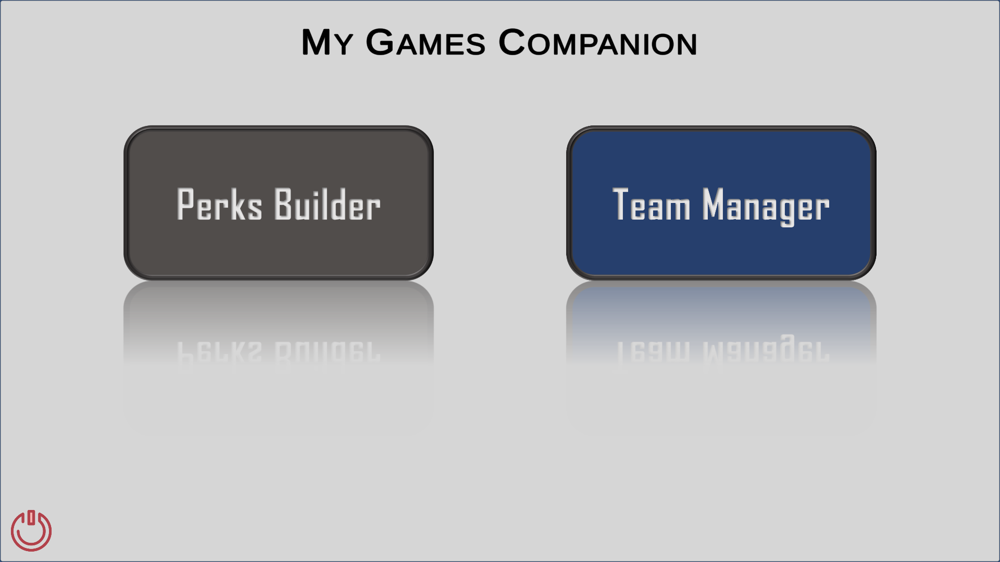
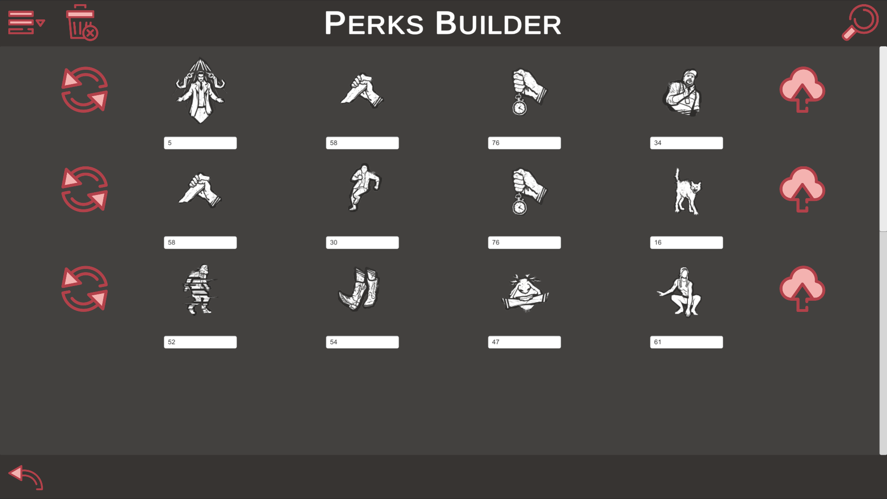
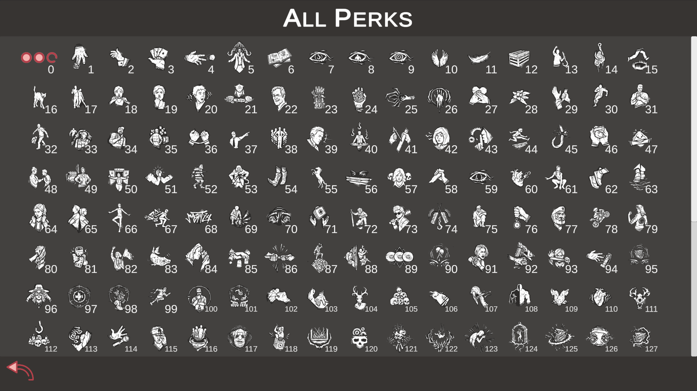
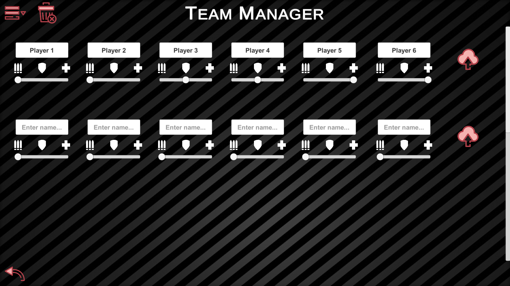

# My Game Companion

## Context:
As a Dead by Daylight fan, I wanted to be able to save my builds because it was not possible in the game. So I developed an application that allows to save builds, create random builds according to player role and display perks images from a json database.

Concerning Dead by Daylight companion, it must be updated regularly according to the game updates (new killers and survivors). In order to update the application without having to modify the application in Unity, I created a json database, deposited on GitHub. It contains all the information about characters perks. When the application is launched and Dead by Daylight companion is selected, it will look for information in this database to create the missing perks. The database was taken over from a creator and then updated because it was obsolete. The database is available [here](MyGamesCompanionData/DeadByDaylightApi.json).

## Gameplay:
First of all, the main menu offers several game companions. The companion for Overwatch allows you to save your team compositions (player names and roles). The Dead by Daylight companion allows you to save your perks builds, generate random ones and have access to the list of all the perks of the game.

  

Here is a preview of the game companion for Dead by Daylight:

  

  

Here is a preview of the game companion for Overwatch:

  

## State:
- [ ] Work in progress
- [X] Work completed