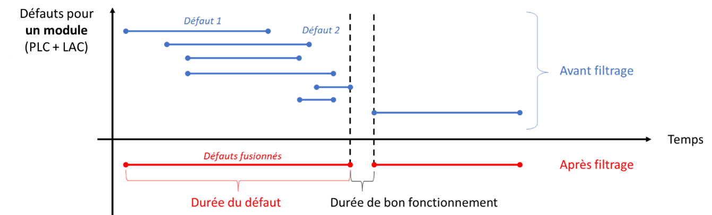
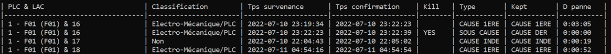
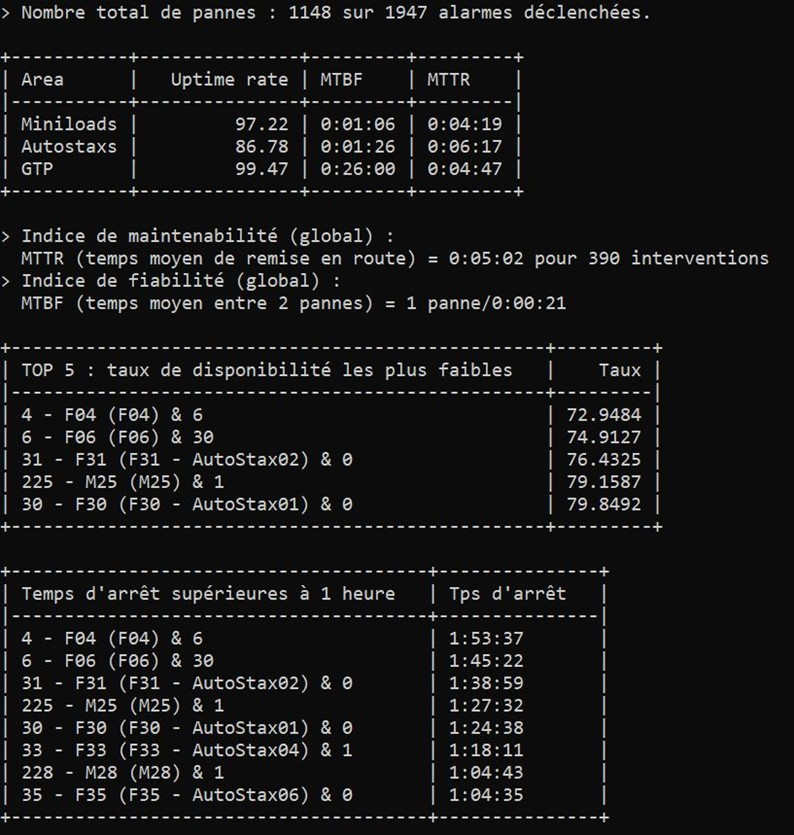

# PLC Performance Calculator

> June to July 2022

**Solving Complex Problems in Data Analysis and Industrial Efficiency**

## I. Context

This project is part of my 2-month internship as an analyst and developer at `Decathlon Logistics`. In the interest of confidentiality, detailed specifics cannot be revealed at this time.

## II. Objective

In an environment that experiences around 20,000 breakdowns weekly, not all are independent. Single breakdowns can trigger several others, and even basic maintenance activities can cause disruptions. These breakdowns may also resolve at different times, further complicating their duration assessment. The objective of this internship was:

The objective of this internship was:
- The verification of the reliability of the performance reports given to the Decathlon global warehouse of Rouvignies.
- The development of a software for automatic calculation of the machines and maintenance teams' performance.

## III. Software Workflow

The software, operated through a Command Line Interface (CLI), simplifies a complex process. Here's how it works:

1. **Data Extraction**: Import the fault table in .csv format for a specific shift or a full week from the .SAV software.
2. **Data Analysis**: The program filters out secondary causes of faults, retaining only primary causes/faults.
3. **KPIs Calculation**: Calculate the duration of each fault (primary causes) and derive the essential Key Performance Indicators (KPIs).
4. **Reporting**: Present results in CLI tables or .csv files for integration into Excel.

## IV. Fault Filtering

<p align="center">
  
</p>

All faults occurring before the end of the fault under consideration are assigned the status "KILL", i.e. they will be eliminated. In fact, between the first fault studied and the last, there was no period of good operation, so this counts as a single stoppage, i.e. a fault. We then consider the next fault, and so on until we've dealt with all the faults one by one.

Let's continue with fault filtering. If a fault has been marked "KILL", it is considered a "SUB CAUSE". Otherwise, it is considered a "FIRST CAUSE" if and only if the following fault is a "SUB CAUSE". Otherwise, it will be assigned the status "INDEPENDENT CAUSE".

Then, the "FIRST CAUSE" and "INDEPENDENT CAUSE" are carried forward, and only the last "SUB CAUSE" in a series of "SUB CAUSES" is carried forward and marked "LAST CAUSE". Inevitably, therefore, there will be empty boxes.

## V. Duration Calculation

These previous operations will enable to calculate the final duration of the fault in its entirety, from its occurrence to confirmation of the last sub-cause. 
- For "INDEPENDENT CAUSE", the duration of the fault is carried forward unchanged. 
- For a "FIRST CAUSE" followed by a series of "SUB CAUSE" up to the "LAST CAUSE", the following calculation is performed:

```
Duration (FIRST CAUSE) = Occurrence (FIST CAUSE) - Confirmation (LAST CAUSE)

Duration (SUB CAUSE) = Duration (LAST CAUSE) = 0
```

<p align="center">
  
</p>

## VI. KPIs Calculation and Reporting
### Downtime
The software generates downtime information, combining module (PLC and LAC combined) breakdown durations to calculate the total downtime during a shift. It also computes the operating time.

```
Operating Time = Shift Time - Total Downtime = Shift Time - ∑ Duration (Module breakdown)
```

### Faults per Module
It calculates the number of faults per module, including "FIRST CAUSE" and "INDEPENDENT CAUSE" faults.

```
Faults per Module = ∑ (FIRST CAUSE + INDEPENDENT CAUSE)
```

### KPIs
Key Performance Indicators are calculated, including Uptime, MTTR, and MTBF. These indicators provide valuable insights into the efficiency of machinery and maintenance teams :
- The Uptime, corresponding to the percentage of time the module is in action or available for use (per module).
- The MTTR (maintainability index) corresponding to the average time required to resolve a breakdown and get the module back into service (per module and overall).
- MTBF (reliability index) corresponding to the average time between two breakdowns (per module and overall).
The different KPI formulas (by module) are given below:

```
Uptime = (Shift Time - Module downtime) / Shift Time

MTTR = Module downtime / Number of Faults

MTBF = (Shift Time - Module downtime) / Number of Faults
```

### Overwall MTTR and MTBR
For calculations of overall MTTR and overall MTBF, the approach requires a few justifications:
Concerning the global MTTR two formulas are possible in order to measure the average MTTR over a shift:

```
(1) MTTR overall = (∑ MTTR per Module) / Nb Modules = ∑ (Module downtime / (Nb Modules * Nb Faults))

(2) MTTR overall = Average Downtime / Average Nb Faults = (∑ Module Downtime) / (∑ Nb Module Faults)
```

Only the first formula has been retained, as the second sums up downtime, which is irrelevant. In fact, over a 7-hour shift, downtime overlaps but does not sum up.

Regarding overall MTBF, two formulas are possible to measure the average MTBF over a shift:

```
(1) MTBF overall = (∑ MTBF per Module) / Nb Modules = ∑ (Shift Time - Module Downtime) / (Nb Modules * Nb Faults)

(2) MTBF overall = (Shift Time - Average Downtime) / Average Nb Faults
```

For this KPI, the second formula has been chosen, as the first does not take into account the superimposition of outage durations during the shift. The second formula superimposes on the same axis the frequency of occurrence of faults in each module, in order to deduce the average frequency. The drawback of this formula is that it performs two approximations due to the averaging of fault frequencies.

Here's an example of a report generated by the software (values are fictitious and for information purposes only):
<p align="center">
  
</p>

### Additional calculations and measurements
The software offers various additional statistics, such as:
- The top 5 lowest Uptime per shift and/or over the week ;
- Modules that have been down for more than a cumulative hour during a shift ;
- Top 5 most frequent faults ;
- Fault occurrence by fault duration range.

In addition, it generates 3 files to be integrated into Excel for graphical visualization:
- Percentage of faults classification by shifts ;
- Percentage of faults classification by PLC and by shifts ;
- All the different faults, without duplicates, by shifts and their occurrence.

**Unleash the Power of Data Analysis for Enhanced Industrial Efficiency!**

> #Python, #Data visualization, #PLC performance monitoring

## VII. State
- [ ] Work in progress
- [X] Work completed
