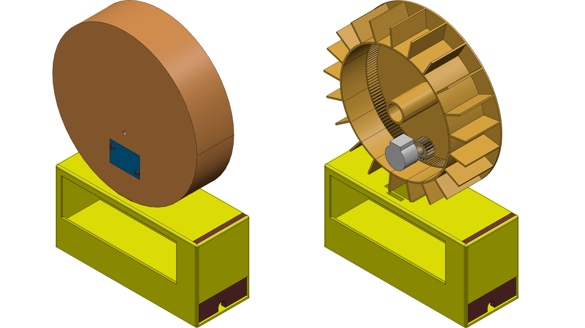
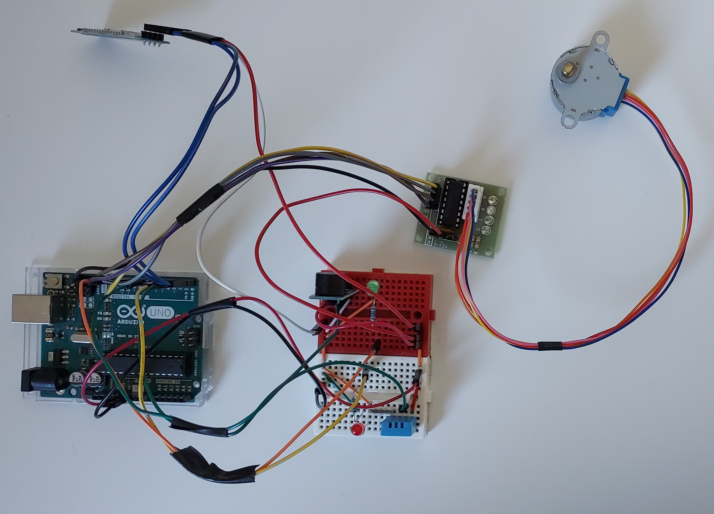
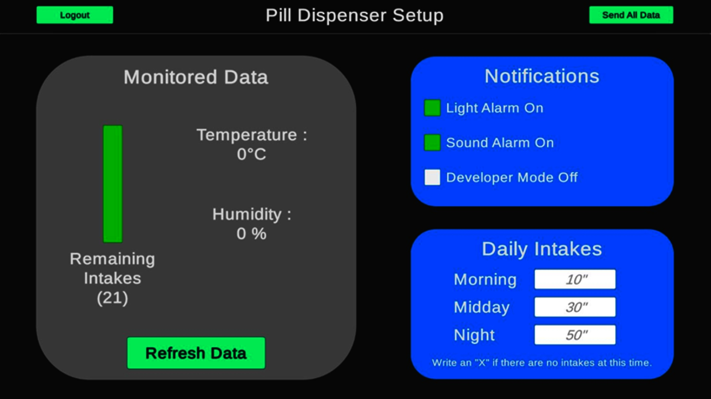

# Pill Dispenser

> January to May 2022

**Revolutionizing Medication Management with a Programmable Pill Dispenser**

  

## I. Context

Welcome to the Pill Dispenser project, a remarkable achievement born out of a school project. Our mission was to design a programmable pill dispenser that could effectively manage a patient's medication. To achieve this, we developed an application using Unity in C# to communicate with the pill dispenser powered by Arduino. The application empowers users to set treatment frequency, monitor medication reserves in the dispenser, and activate light and sound alarms to remind patients to take their medication. Additionally, the pill dispenser was meticulously designed in 3D using 3D Experience and brought to life with a 3D printer.

## II. Conception

We embarked on this project from scratch. We began by brainstorming the essential features of the pill dispenser and devising technical solutions to meet those requirements. Afterward, we dimensioned the pill dispenser and created a 3D model using 3D Experience. The physical pill dispenser was then materialized using a 3D printer. Simultaneously, we developed the application and the electrical circuit for the pill dispenser. You can find the source codes for both the pill dispenser and the application in this repository. Below is a sneak peek of the 3D model and the electric circuit of the pill dispenser:

  

  

## III. Features

Behold the user-friendly interface of our Unity application:

  

The application is divided into two main sections:

- **Data Monitoring**: This panel allows you to keep a close eye on humidity and temperature, ensuring optimal pill storage. Values turn red when conditions are unfavorable. It also displays the number of remaining intakes, ensuring you know when it's time to refill the dispenser.

- **Set-up**: These two panels enable you to activate alarms and configure intake schedules for each day. This feature simplifies experimental tests by allowing you to change parameters at intervals.

Once the connection is established between the application and the Arduino microcontroller of the pill dispenser, you can effortlessly send set-up parameters to the pill dispenser, ensuring it operates according to your preferences.

**Transforming Medication Management, One Pill at a Time!**

> #Unity, #IoT (Arduino), #CAD

## IV. Project Status

- [ ] Work in progress
- [X] Work completed