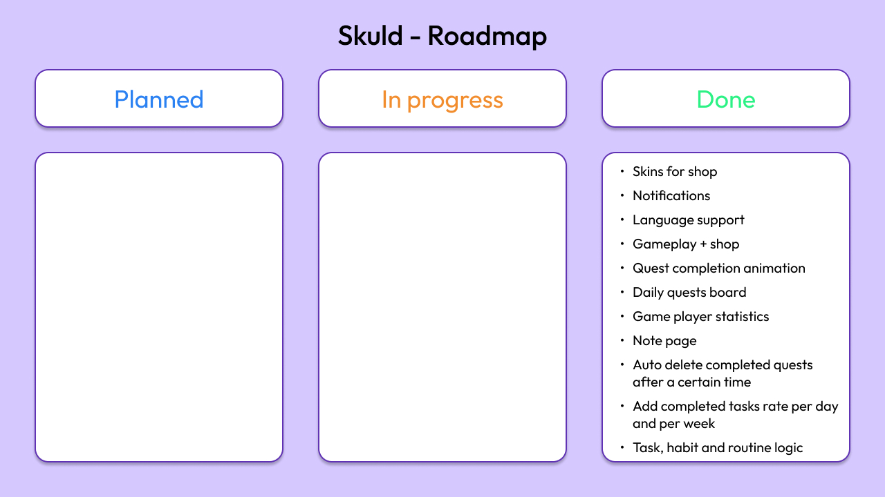

# Skuld

> October 2024

Download [link](https://github.com/Quedow/projects/releases)

**Turn your daily life into a quest with Skuld**

  

## I. Context

Introducing Skuld, a productivity app to transform your tasks, habits and routines into quests that help you stay motivated and organized. Gamify your life by completing quests to  earn XP, level up, and collect credits.Get upgrades and use your credits in the in-app shop to customize your experience and make the app truly yours.

## Features
- **Tasks:** Prioritize your tasks using the Eisenhower Matrix,
- **Habits:** Track good and bad habits with counters,
- **Routines:** Schedule routines and their frequency,
- **Notifications**: Notified before the deadline for your tasks,
- **Global note**.

  
  

*Available in French and English.*

## II. Roadmap

  

## III. Project Status

- [X] Work in progress
- [ ] Work completed
