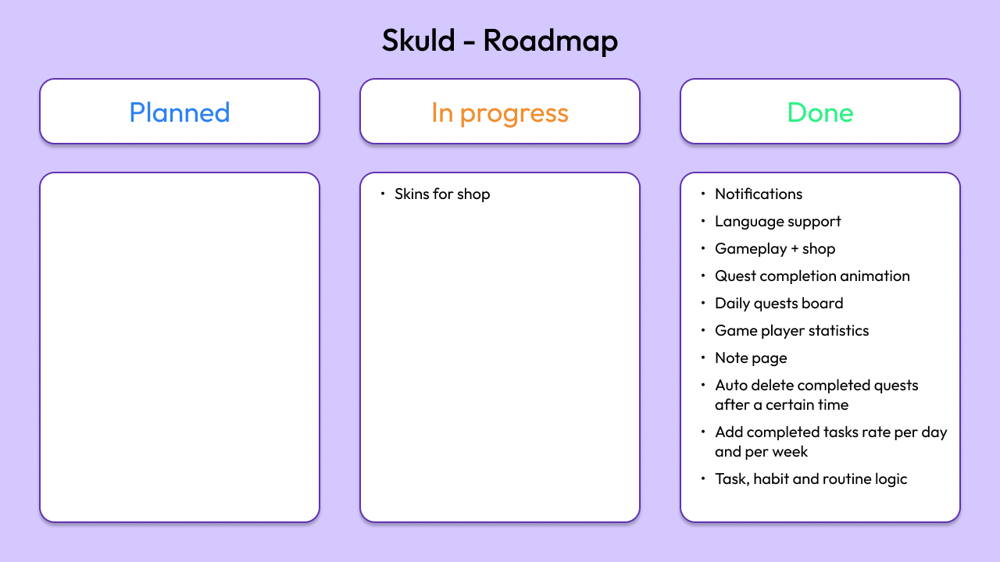

# Skuld

> October 2024

Download [link](https://github.com/Quedow/projects/releases)

**Turn your daily life into a quest with Skuld**

  

## I. Context

Skuld transforms your daily tasks, habits, and routines into a fun RPG-style adventure. Stay motivated, stay organized, and level up your real life by completing quests, earning XP, and collecting credits.

Unlock cosmetic items through mystery boxes and give your character a look that no one else has. Productivity has never felt this rewarding.

## II. Features

**Tasks**  
Prioritize what matters using an intuitive Eisenhower Matrix and watch your to-do list become a series of heroic missions.

**Habits**  
Build good habits and weaken bad ones using counters that feel like stat management in a game.

**Routines**  
Set recurring routines with flexible frequencies to keep your real-life gameplay consistent.

**Notifications**  
Get notified before quest deadlines.

**Global note**  
Keep all your important thoughts in one place.

  
  

*Available in French and English.*

## II. Roadmap

  

## III. Project Status

- [X] Work in progress
- [ ] Work completed
