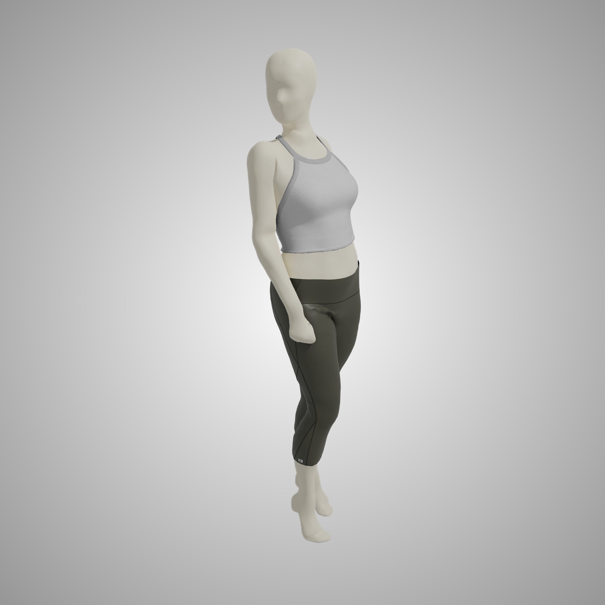

# Textile Packshot Image Creator

> May to August 2023

**An Innovative Solution for Effortless Packshot Creation**

  

## I. Context

Welcome to the Textile Packshot Image Creator, a groundbreaking project born during my 4-month R&D engineering internship at `Decathlon SportsLab`. In the interest of confidentiality, detailed specifics cannot be revealed at this time.

## II. Objective

My mission was to revolutionize the creation of product images, commonly known as packshots. Packshots are high-quality visuals that serve to showcase and captivate consumers. In addition to this, we're replacing traditional mannequins with avatars and fully digitized products.

**Why it Matters:**
- **Efficiency**: Say goodbye to time-consuming and costly photo shoots with mannequins.
- **Flexibility**: Avatars offer limitless possibilities for poses, multiple shots, and scene arrangements.
- **Reach more Customers**: Avatars promote more inclusivity and diversity in terms of morphology and physical characteristics, by using AI.

## III. The Tool

The solution comes in the form of an ingenious Python automation tool. This versatile tool empowers you to:

- Seamlessly upload your textile product, input essential information, and watch as your packshot materializes.
- Create captivating avatar/textile product packshots from 3D product renderings.
- Build bridges between Clo 3D and Blender 3D software through Python scripts, utilizing their APIs.

**Here's how it works:**

- **Clo 3D**: Simulates 3D textiles on an avatar, bringing poses to life.
- **Blender 3D**: Sets up the perfect photo shoot scene with a range of camera angles.
- **Python script**: Generates the finale packshot images and save them on the computer.
- **AI** (external process): Transforms blank avatars into photo-realistic avatars to allow customers to identify with them.

When the process is complete, the tool presents you with a stunning packshot of your product. (Please note that the example below is not the final product, due to confidentiality reasons.)

  

### What it Makes Possible

The Textile Packshot Image Creator empowers users to:

- Generate packshots of garments/accessories on avatars.
- Create vacuum garment packshots.
- Customize poses, angles of view, and lighting for avatars and rendering scene.

Additionally, the tool offers the flexibility to:

- Install the tool on any computer.
- Access it remotely from any computer.

## IV. Additional Information

- The number and variation of camera angles have been meticulously defined in collaboration with image team leaders.
- The poses are meticulously crafted in Blender 3D, derived from 3D scans of mannequins and adjusted using template fitting.

**Unlock the Future of Packshot Creation!**

> #Python, #Clo 3D, #Blender 3D, #Generative AI, #Process automation

## V. State
- [ ] Work in progress
- [X] Work completed
